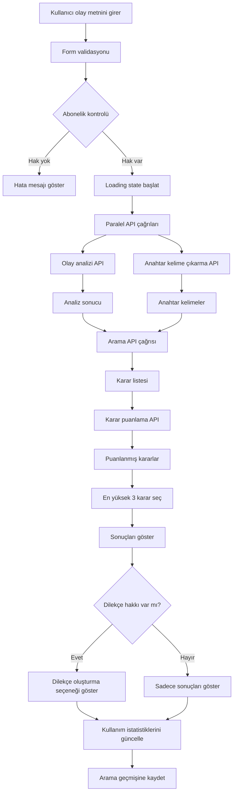
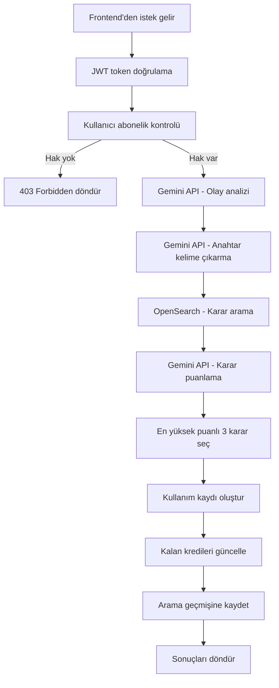

# API Entegrasyonu ve Arama İşlemi Akışı

## API Mimarisi ve Endpoint Yapısı

### Base URL Konfigürasyonu
```typescript
// src/config/api.ts
export const API_CONFIG = {
  BASE_URL: process.env.REACT_APP_API_BASE_URL || 'http://localhost:5000',
  TIMEOUT: 30000,
  RETRY_ATTEMPTS: 3,
  RETRY_DELAY: 1000
};

export const ENDPOINTS = {
  AUTH: {
    LOGIN: '/api/auth/login',
    REGISTER: '/api/auth/register',
    REFRESH: '/api/auth/refresh',
    LOGOUT: '/api/auth/logout',
    PROFILE: '/api/auth/profile'
  },
  SUBSCRIPTION: {
    CURRENT: '/api/subscription/current',
    PLANS: '/api/subscription/plans',
    UPGRADE: '/api/subscription/upgrade',
    USAGE: '/api/subscription/usage',
    REMAINING_CREDITS: '/api/subscription/remaining-credits'
  },
  AI: {
    EXTRACT_KEYWORDS: '/api/ai/extract-keywords',
    ANALYZE_CASE: '/api/ai/analyze-case',
    SCORE_DECISIONS: '/api/ai/score-decisions'
  },
  SEARCH: {
    SEARCH: '/api/search/search',
    HISTORY: '/api/search/history',
    SAVE_DECISION: '/api/search/save-decision'
  },
  PETITION: {
    GENERATE: '/api/petition/generate',
    HISTORY: '/api/petition/history'
  }
};
```

### HTTP Client Konfigürasyonu
```typescript
// src/services/httpClient.ts
import axios, { AxiosInstance, AxiosRequestConfig, AxiosResponse } from 'axios';
import { API_CONFIG } from '../config/api';
import { AuthService } from './authService';

class HttpClient {
  private client: AxiosInstance;
  private authService: AuthService;

  constructor() {
    this.client = axios.create({
      baseURL: API_CONFIG.BASE_URL,
      timeout: API_CONFIG.TIMEOUT,
      headers: {
        'Content-Type': 'application/json',
        'Accept': 'application/json'
      }
    });

    this.authService = new AuthService();
    this.setupInterceptors();
  }

  private setupInterceptors(): void {
    // Request interceptor - JWT token ekleme
    this.client.interceptors.request.use(
      (config) => {
        const token = this.authService.getToken();
        if (token) {
          config.headers.Authorization = `Bearer ${token}`;
        }
        return config;
      },
      (error) => Promise.reject(error)
    );

    // Response interceptor - Token yenileme ve error handling
    this.client.interceptors.response.use(
      (response) => response,
      async (error) => {
        const originalRequest = error.config;

        if (error.response?.status === 401 && !originalRequest._retry) {
          originalRequest._retry = true;

          try {
            await this.authService.refreshToken();
            const newToken = this.authService.getToken();
            originalRequest.headers.Authorization = `Bearer ${newToken}`;
            return this.client(originalRequest);
          } catch (refreshError) {
            this.authService.logout();
            window.location.href = '/login';
            return Promise.reject(refreshError);
          }
        }

        return Promise.reject(error);
      }
    );
  }

  async get<T>(url: string, config?: AxiosRequestConfig): Promise<T> {
    const response: AxiosResponse<T> = await this.client.get(url, config);
    return response.data;
  }

  async post<T>(url: string, data?: any, config?: AxiosRequestConfig): Promise<T> {
    const response: AxiosResponse<T> = await this.client.post(url, data, config);
    return response.data;
  }

  async put<T>(url: string, data?: any, config?: AxiosRequestConfig): Promise<T> {
    const response: AxiosResponse<T> = await this.client.put(url, data, config);
    return response.data;
  }

  async delete<T>(url: string, config?: AxiosRequestConfig): Promise<T> {
    const response: AxiosResponse<T> = await this.client.delete(url, config);
    return response.data;
  }
}

export const httpClient = new HttpClient();
```

## Authentication Service

### AuthService Implementation
```typescript
// src/services/authService.ts
import { httpClient } from './httpClient';
import { ENDPOINTS } from '../config/api';

export interface LoginCredentials {
  email: string;
  password: string;
}

export interface RegisterData {
  firstName: string;
  lastName: string;
  email: string;
  password: string;
  confirmPassword: string;
}

export interface User {
  id: string;
  email: string;
  firstName: string;
  lastName: string;
  name: string;
  avatar?: string;
  createdAt: string;
  lastLoginAt: string;
}

export interface AuthResponse {
  token: string;
  refreshToken: string;
  user: User;
  expiresIn: number;
}

export class AuthService {
  private readonly TOKEN_KEY = 'yargisalzeka_token';
  private readonly REFRESH_TOKEN_KEY = 'yargisalzeka_refresh_token';
  private readonly USER_KEY = 'yargisalzeka_user';

  async login(credentials: LoginCredentials): Promise<AuthResponse> {
    try {
      const response = await httpClient.post<AuthResponse>(
        ENDPOINTS.AUTH.LOGIN,
        credentials
      );

      this.setTokens(response.token, response.refreshToken);
      this.setUser(response.user);

      return response;
    } catch (error) {
      throw new Error('Giriş başarısız. Lütfen bilgilerinizi kontrol edin.');
    }
  }

  async register(userData: RegisterData): Promise<AuthResponse> {
    try {
      const response = await httpClient.post<AuthResponse>(
        ENDPOINTS.AUTH.REGISTER,
        userData
      );

      this.setTokens(response.token, response.refreshToken);
      this.setUser(response.user);

      return response;
    } catch (error) {
      throw new Error('Kayıt başarısız. Lütfen bilgilerinizi kontrol edin.');
    }
  }

  async refreshToken(): Promise<string> {
    const refreshToken = this.getRefreshToken();
    if (!refreshToken) {
      throw new Error('Refresh token bulunamadı');
    }

    try {
      const response = await httpClient.post<{ token: string; refreshToken: string }>(
        ENDPOINTS.AUTH.REFRESH,
        { refreshToken }
      );

      this.setTokens(response.token, response.refreshToken);
      return response.token;
    } catch (error) {
      this.logout();
      throw new Error('Token yenileme başarısız');
    }
  }

  async getProfile(): Promise<User> {
    try {
      const user = await httpClient.get<User>(ENDPOINTS.AUTH.PROFILE);
      this.setUser(user);
      return user;
    } catch (error) {
      throw new Error('Profil bilgileri alınamadı');
    }
  }

  logout(): void {
    localStorage.removeItem(this.TOKEN_KEY);
    localStorage.removeItem(this.REFRESH_TOKEN_KEY);
    localStorage.removeItem(this.USER_KEY);
  }

  getToken(): string | null {
    return localStorage.getItem(this.TOKEN_KEY);
  }

  getRefreshToken(): string | null {
    return localStorage.getItem(this.REFRESH_TOKEN_KEY);
  }

  getUser(): User | null {
    const userStr = localStorage.getItem(this.USER_KEY);
    return userStr ? JSON.parse(userStr) : null;
  }

  isAuthenticated(): boolean {
    const token = this.getToken();
    if (!token) return false;

    try {
      const payload = JSON.parse(atob(token.split('.')[1]));
      return payload.exp * 1000 > Date.now();
    } catch {
      return false;
    }
  }

  private setTokens(token: string, refreshToken: string): void {
    localStorage.setItem(this.TOKEN_KEY, token);
    localStorage.setItem(this.REFRESH_TOKEN_KEY, refreshToken);
  }

  private setUser(user: User): void {
    localStorage.setItem(this.USER_KEY, JSON.stringify(user));
  }
}
```

## Subscription Service

### SubscriptionService Implementation
```typescript
// src/services/subscriptionService.ts
import { httpClient } from './httpClient';
import { ENDPOINTS } from '../config/api';

export interface SubscriptionPlan {
  id: number;
  name: string;
  price: number;
  validityDays?: number;
  features: {
    keywordExtraction: number; // -1 = unlimited
    caseAnalysis: number;
    search: number;
    petition: number;
  };
  isActive: boolean;
  isPopular?: boolean;
}

export interface UserSubscription {
  id: number;
  plan: SubscriptionPlan;
  startDate: string;
  endDate?: string;
  isActive: boolean;
  remainingDays?: number;
}

export interface RemainingCredits {
  keywordExtraction: number;
  caseAnalysis: number;
  search: number;
  petition: number;
}

export interface UsageStats {
  totalThisMonth: number;
  dailyUsage: DailyUsage[];
  featureUsage: FeatureUsage[];
}

export interface DailyUsage {
  date: string;
  searches: number;
  analyses: number;
  petitions: number;
}

export interface FeatureUsage {
  feature: string;
  used: number;
  limit: number;
  percentage: number;
}

export class SubscriptionService {
  async getCurrentSubscription(): Promise<UserSubscription> {
    try {
      return await httpClient.get<UserSubscription>(ENDPOINTS.SUBSCRIPTION.CURRENT);
    } catch (error) {
      throw new Error('Abonelik bilgileri alınamadı');
    }
  }

  async getSubscriptionPlans(): Promise<SubscriptionPlan[]> {
    try {
      return await httpClient.get<SubscriptionPlan[]>(ENDPOINTS.SUBSCRIPTION.PLANS);
    } catch (error) {
      throw new Error('Abonelik paketleri alınamadı');
    }
  }

  async upgradeSubscription(planId: number): Promise<void> {
    try {
      await httpClient.post(ENDPOINTS.SUBSCRIPTION.UPGRADE, { planId });
    } catch (error) {
      throw new Error('Abonelik yükseltme başarısız');
    }
  }

  async getRemainingCredits(): Promise<RemainingCredits> {
    try {
      return await httpClient.get<RemainingCredits>(ENDPOINTS.SUBSCRIPTION.REMAINING_CREDITS);
    } catch (error) {
      throw new Error('Kalan kredi bilgileri alınamadı');
    }
  }

  async getUsageStats(): Promise<UsageStats> {
    try {
      return await httpClient.get<UsageStats>(ENDPOINTS.SUBSCRIPTION.USAGE);
    } catch (error) {
      throw new Error('Kullanım istatistikleri alınamadı');
    }
  }
}
```

## AI Service

### AIService Implementation
```typescript
// src/services/aiService.ts
import { httpClient } from './httpClient';
import { ENDPOINTS } from '../config/api';

export interface KeywordExtractionRequest {
  caseText: string;
}

export interface KeywordExtractionResponse {
  keywords: string[];
  confidence: number;
  processingTime: number;
}

export interface CaseAnalysisRequest {
  caseText: string;
}

export interface CaseAnalysisResponse {
  caseType: string;
  legalAreas: string[];
  potentialOutcomes: string[];
  relevantLegislation: string[];
  riskLevel: 'LOW' | 'MEDIUM' | 'HIGH';
  confidence: number;
  summary: string;
}

export interface DecisionScoringRequest {
  decisions: Decision[];
  caseText: string;
}

export interface DecisionScoringResponse {
  scoredDecisions: ScoredDecision[];
}

export interface Decision {
  id: string;
  title: string;
  court: string;
  date: string;
  number: string;
  content: string;
  summary: string;
  keywords: string[];
}

export interface ScoredDecision {
  decision: Decision;
  score: number;
  relevanceReasons: string[];
}

export class AIService {
  async extractKeywords(request: KeywordExtractionRequest): Promise<KeywordExtractionResponse> {
    try {
      return await httpClient.post<KeywordExtractionResponse>(
        ENDPOINTS.AI.EXTRACT_KEYWORDS,
        request
      );
    } catch (error) {
      throw new Error('Anahtar kelime çıkarma başarısız');
    }
  }

  async analyzeCase(request: CaseAnalysisRequest): Promise<CaseAnalysisResponse> {
    try {
      return await httpClient.post<CaseAnalysisResponse>(
        ENDPOINTS.AI.ANALYZE_CASE,
        request
      );
    } catch (error) {
      throw new Error('Olay analizi başarısız');
    }
  }

  async scoreDecisions(request: DecisionScoringRequest): Promise<DecisionScoringResponse> {
    try {
      return await httpClient.post<DecisionScoringResponse>(
        ENDPOINTS.AI.SCORE_DECISIONS,
        request
      );
    } catch (error) {
      throw new Error('Karar puanlama başarısız');
    }
  }
}
```

## Search Service

### SearchService Implementation
```typescript
// src/services/searchService.ts
import { httpClient } from './httpClient';
import { ENDPOINTS } from '../config/api';
import { Decision, ScoredDecision, CaseAnalysisResponse, KeywordExtractionResponse } from './aiService';

export interface SearchRequest {
  caseText: string;
  filters?: SearchFilters;
}

export interface SearchFilters {
  courts?: string[];
  dateRange?: {
    startDate: string;
    endDate: string;
  };
  caseTypes?: string[];
}

export interface SearchResponse {
  analysis: CaseAnalysisResponse;
  keywords: KeywordExtractionResponse;
  decisions: ScoredDecision[];
  totalResults: number;
  processingTime: number;
  searchId: string;
}

export interface SearchHistoryItem {
  id: string;
  caseText: string;
  searchDate: string;
  resultsCount: number;
  topDecisions: Decision[];
  analysis: CaseAnalysisResponse;
}

export interface SaveDecisionRequest {
  decisionId: string;
  searchId?: string;
  notes?: string;
}

export class SearchService {
  async searchCases(request: SearchRequest): Promise<SearchResponse> {
    try {
      // Paralel olarak analiz ve anahtar kelime çıkarma
      const [analysisResponse, keywordsResponse] = await Promise.all([
        httpClient.post<CaseAnalysisResponse>(ENDPOINTS.AI.ANALYZE_CASE, {
          caseText: request.caseText
        }),
        httpClient.post<KeywordExtractionResponse>(ENDPOINTS.AI.EXTRACT_KEYWORDS, {
          caseText: request.caseText
        })
      ]);

      // Anahtar kelimelerle arama yap
      const searchResponse = await httpClient.post<{ decisions: Decision[] }>(
        ENDPOINTS.SEARCH.SEARCH,
        {
          keywords: keywordsResponse.keywords,
          filters: request.filters
        }
      );

      // Kararları puanla
      const scoringResponse = await httpClient.post<DecisionScoringResponse>(
        ENDPOINTS.AI.SCORE_DECISIONS,
        {
          decisions: searchResponse.decisions,
          caseText: request.caseText
        }
      );

      // En yüksek puanlı 3 kararı al
      const topDecisions = scoringResponse.scoredDecisions
        .sort((a, b) => b.score - a.score)
        .slice(0, 3);

      return {
        analysis: analysisResponse,
        keywords: keywordsResponse,
        decisions: topDecisions,
        totalResults: searchResponse.decisions.length,
        processingTime: Date.now(), // Bu backend'den gelecek
        searchId: `search_${Date.now()}` // Bu backend'den gelecek
      };
    } catch (error) {
      throw new Error('Arama işlemi başarısız');
    }
  }

  async getSearchHistory(): Promise<SearchHistoryItem[]> {
    try {
      return await httpClient.get<SearchHistoryItem[]>(ENDPOINTS.SEARCH.HISTORY);
    } catch (error) {
      throw new Error('Arama geçmişi alınamadı');
    }
  }

  async saveDecision(request: SaveDecisionRequest): Promise<void> {
    try {
      await httpClient.post(ENDPOINTS.SEARCH.SAVE_DECISION, request);
    } catch (error) {
      throw new Error('Karar kaydetme başarısız');
    }
  }
}
```

## Petition Service

### PetitionService Implementation
```typescript
// src/services/petitionService.ts
import { httpClient } from './httpClient';
import { ENDPOINTS } from '../config/api';
import { SearchResponse } from './searchService';

export interface PetitionGenerationRequest {
  caseData: SearchResponse;
  petitionType: 'DAVA' | 'ICRA' | 'ITIRAZ' | 'TEMYIZ';
  clientInfo: {
    name: string;
    address: string;
    tcNo?: string;
    phone?: string;
  };
  opposingParty?: {
    name: string;
    address?: string;
  };
  additionalRequests?: string;
}

export interface PetitionResponse {
  id: string;
  content: string;
  petitionType: string;
  createdAt: string;
  downloadUrl: string;
}

export interface PetitionHistoryItem {
  id: string;
  petitionType: string;
  clientName: string;
  createdAt: string;
  status: 'DRAFT' | 'COMPLETED' | 'DOWNLOADED';
  downloadUrl?: string;
}

export class PetitionService {
  async generatePetition(request: PetitionGenerationRequest): Promise<PetitionResponse> {
    try {
      return await httpClient.post<PetitionResponse>(
        ENDPOINTS.PETITION.GENERATE,
        request
      );
    } catch (error) {
      throw new Error('Dilekçe oluşturma başarısız');
    }
  }

  async getPetitionHistory(): Promise<PetitionHistoryItem[]> {
    try {
      return await httpClient.get<PetitionHistoryItem[]>(ENDPOINTS.PETITION.HISTORY);
    } catch (error) {
      throw new Error('Dilekçe geçmişi alınamadı');
    }
  }

  async downloadPetition(petitionId: string): Promise<Blob> {
    try {
      const response = await httpClient.get(`${ENDPOINTS.PETITION.GENERATE}/${petitionId}/download`, {
        responseType: 'blob'
      });
      return response as unknown as Blob;
    } catch (error) {
      throw new Error('Dilekçe indirme başarısız');
    }
  }
}
```

## React Hooks for State Management

### useAuth Hook
```typescript
// src/hooks/useAuth.ts
import { createContext, useContext, useReducer, useEffect, ReactNode } from 'react';
import { AuthService, User, LoginCredentials, RegisterData } from '../services/authService';

interface AuthState {
  user: User | null;
  isAuthenticated: boolean;
  isLoading: boolean;
  error: string | null;
}

type AuthAction =
  | { type: 'AUTH_START' }
  | { type: 'AUTH_SUCCESS'; payload: User }
  | { type: 'AUTH_ERROR'; payload: string }
  | { type: 'AUTH_LOGOUT' };

const initialState: AuthState = {
  user: null,
  isAuthenticated: false,
  isLoading: true,
  error: null
};

const authReducer = (state: AuthState, action: AuthAction): AuthState => {
  switch (action.type) {
    case 'AUTH_START':
      return { ...state, isLoading: true, error: null };
    case 'AUTH_SUCCESS':
      return {
        ...state,
        user: action.payload,
        isAuthenticated: true,
        isLoading: false,
        error: null
      };
    case 'AUTH_ERROR':
      return {
        ...state,
        user: null,
        isAuthenticated: false,
        isLoading: false,
        error: action.payload
      };
    case 'AUTH_LOGOUT':
      return {
        ...state,
        user: null,
        isAuthenticated: false,
        isLoading: false,
        error: null
      };
    default:
      return state;
  }
};

const AuthContext = createContext<{
  state: AuthState;
  login: (credentials: LoginCredentials) => Promise<void>;
  register: (userData: RegisterData) => Promise<void>;
  logout: () => void;
  refreshUser: () => Promise<void>;
} | null>(null);

export const AuthProvider: React.FC<{ children: ReactNode }> = ({ children }) => {
  const [state, dispatch] = useReducer(authReducer, initialState);
  const authService = new AuthService();

  useEffect(() => {
    const initAuth = async () => {
      if (authService.isAuthenticated()) {
        try {
          const user = await authService.getProfile();
          dispatch({ type: 'AUTH_SUCCESS', payload: user });
        } catch (error) {
          dispatch({ type: 'AUTH_ERROR', payload: 'Kullanıcı bilgileri alınamadı' });
        }
      } else {
        dispatch({ type: 'AUTH_LOGOUT' });
      }
    };

    initAuth();
  }, []);

  const login = async (credentials: LoginCredentials) => {
    dispatch({ type: 'AUTH_START' });
    try {
      const response = await authService.login(credentials);
      dispatch({ type: 'AUTH_SUCCESS', payload: response.user });
    } catch (error) {
      dispatch({ type: 'AUTH_ERROR', payload: error.message });
      throw error;
    }
  };

  const register = async (userData: RegisterData) => {
    dispatch({ type: 'AUTH_START' });
    try {
      const response = await authService.register(userData);
      dispatch({ type: 'AUTH_SUCCESS', payload: response.user });
    } catch (error) {
      dispatch({ type: 'AUTH_ERROR', payload: error.message });
      throw error;
    }
  };

  const logout = () => {
    authService.logout();
    dispatch({ type: 'AUTH_LOGOUT' });
  };

  const refreshUser = async () => {
    try {
      const user = await authService.getProfile();
      dispatch({ type: 'AUTH_SUCCESS', payload: user });
    } catch (error) {
      dispatch({ type: 'AUTH_ERROR', payload: 'Kullanıcı bilgileri güncellenemedi' });
    }
  };

  return (
    <AuthContext.Provider value={{ state, login, register, logout, refreshUser }}>
      {children}
    </AuthContext.Provider>
  );
};

export const useAuth = () => {
  const context = useContext(AuthContext);
  if (!context) {
    throw new Error('useAuth must be used within an AuthProvider');
  }
  return context;
};
```

### useSubscription Hook
```typescript
// src/hooks/useSubscription.ts
import { createContext, useContext, useReducer, useEffect, ReactNode } from 'react';
import { SubscriptionService, UserSubscription, RemainingCredits, UsageStats, SubscriptionPlan } from '../services/subscriptionService';

interface SubscriptionState {
  currentPlan: UserSubscription | null;
  remainingCredits: RemainingCredits | null;
  usageStats: UsageStats | null;
  availablePlans: SubscriptionPlan[];
  isLoading: boolean;
  error: string | null;
}

type SubscriptionAction =
  | { type: 'SUBSCRIPTION_START' }
  | { type: 'SUBSCRIPTION_SUCCESS'; payload: Partial<SubscriptionState> }
  | { type: 'SUBSCRIPTION_ERROR'; payload: string }
  | { type: 'UPDATE_CREDITS'; payload: RemainingCredits };

const initialState: SubscriptionState = {
  currentPlan: null,
  remainingCredits: null,
  usageStats: null,
  availablePlans: [],
  isLoading: true,
  error: null
};

const subscriptionReducer = (state: SubscriptionState, action: SubscriptionAction): SubscriptionState => {
  switch (action.type) {
    case 'SUBSCRIPTION_START':
      return { ...state, isLoading: true, error: null };
    case 'SUBSCRIPTION_SUCCESS':
      return { ...state, ...action.payload, isLoading: false, error: null };
    case 'SUBSCRIPTION_ERROR':
      return { ...state, isLoading: false, error: action.payload };
    case 'UPDATE_CREDITS':
      return { ...state, remainingCredits: action.payload };
    default:
      return state;
  }
};

const SubscriptionContext = createContext<{
  state: SubscriptionState;
  refreshSubscription: () => Promise<void>;
  upgradeSubscription: (planId: number) => Promise<void>;
  consumeCredit: (feature: string) => void;
} | null>(null);

export const SubscriptionProvider: React.FC<{ children: ReactNode }> = ({ children }) => {
  const [state, dispatch] = useReducer(subscriptionReducer, initialState);
  const subscriptionService = new SubscriptionService();

  useEffect(() => {
    loadSubscriptionData();
  }, []);

  const loadSubscriptionData = async () => {
    dispatch({ type: 'SUBSCRIPTION_START' });
    try {
      const [currentPlan, remainingCredits, usageStats, availablePlans] = await Promise.all([
        subscriptionService.getCurrentSubscription(),
        subscriptionService.getRemainingCredits(),
        subscriptionService.getUsageStats(),
        subscriptionService.getSubscriptionPlans()
      ]);

      dispatch({
        type: 'SUBSCRIPTION_SUCCESS',
        payload: { currentPlan, remainingCredits, usageStats, availablePlans }
      });
    } catch (error) {
      dispatch({ type: 'SUBSCRIPTION_ERROR', payload: error.message });
    }
  };

  const refreshSubscription = async () => {
    await loadSubscriptionData();
  };

  const upgradeSubscription = async (planId: number) => {
    try {
      await subscriptionService.upgradeSubscription(planId);
      await refreshSubscription();
    } catch (error) {
      dispatch({ type: 'SUBSCRIPTION_ERROR', payload: error.message });
      throw error;
    }
  };

  const consumeCredit = (feature: string) => {
    if (!state.remainingCredits) return;

    const updatedCredits = { ...state.remainingCredits };
    switch (feature) {
      case 'search':
        updatedCredits.search = Math.max(0, updatedCredits.search - 1);
        break;
      case 'caseAnalysis':
        updatedCredits.caseAnalysis = Math.max(0, updatedCredits.caseAnalysis - 1);
        break;
      case 'petition':
        updatedCredits.petition = Math.max(0, updatedCredits.petition - 1);
        break;
    }

    dispatch({ type: 'UPDATE_CREDITS', payload: updatedCredits });
  };

  return (
    <SubscriptionContext.Provider value={{ state, refreshSubscription, upgradeSubscription, consumeCredit }}>
      {children}
    </SubscriptionContext.Provider>
  );
};

export const useSubscription = () => {
  const context = useContext(SubscriptionContext);
  if (!context) {
    throw new Error('useSubscription must be used within a SubscriptionProvider');
  }
  return context;
};
```

### useSearch Hook
```typescript
// src/hooks/useSearch.ts
import { useState, useCallback } from 'react';
import { SearchService, SearchRequest, SearchResponse, SearchHistoryItem } from '../services/searchService';
import { useSubscription } from './useSubscription';

export const useSearch = () => {
  const [isSearching, setIsSearching] = useState(false);
  const [searchHistory, setSearchHistory] = useState<SearchHistoryItem[]>([]);
  const [currentSearch, setCurrentSearch] = useState<SearchResponse | null>(null);
  const { consumeCredit } = useSubscription();
  
  const searchService = new SearchService();

  const searchCases = useCallback(async (caseText: string, filters?: any): Promise<SearchResponse> => {
    setIsSearching(true);
    try {
      const request: SearchRequest = { caseText, filters };
      const response = await searchService.searchCases(request);
      
      setCurrentSearch(response);
      consumeCredit('search');
      consumeCredit('caseAnalysis');
      
      // Arama geçmişini güncelle
      await loadSearchHistory();
      
      return response;
    } catch (error) {
      throw error;
    } finally {
      setIsSearching(false);
    }
  }, [consumeCredit]);

  const loadSearchHistory = useCallback(async () => {
    try {
      const history = await searchService.getSearchHistory();
      setSearchHistory(history);
    } catch (error) {
      console.error('Arama geçmişi yüklenemedi:', error);
    }
  }, []);

  const saveDecision = useCallback(async (decisionId: string, searchId?: string, notes?: string) => {
    try {
      await searchService.saveDecision({ decisionId, searchId, notes });
    } catch (error) {
      throw error;
    }
  }, []);

  return {
    isSearching,
    searchHistory,
    currentSearch,
    searchCases,
    loadSearchHistory,
    saveDecision,
    setCurrentSearch
  };
};
```

## Arama İşlemi Akış Diagramı

### Frontend Akışı


### Backend Akışı


## Error Handling ve Retry Logic

### Error Handling Service
```typescript
// src/services/errorHandler.ts
export class ApiError extends Error {
  constructor(
    message: string,
    public status: number,
    public code?: string,
    public details?: any
  ) {
    super(message);
    this.name = 'ApiError';
  }
}

export const handleApiError = (error: any): ApiError => {
  if (error.response) {
    const { status, data } = error.response;
    return new ApiError(
      data.message || 'Bir hata oluştu',
      status,
      data.code,
      data.details
    );
  } else if (error.request) {
    return new ApiError('Sunucuya ulaşılamıyor', 0, 'NETWORK_ERROR');
  } else {
    return new ApiError('Beklenmeyen bir hata oluştu', 0, 'UNKNOWN_ERROR');
  }
};

export const retryWithBackoff = async <T>(
  fn: () => Promise<T>,
  maxRetries: number = 3,
  baseDelay: number = 1000
): Promise<T> => {
  let lastError: Error;

  for (let i = 0; i <= maxRetries; i++) {
    try {
      return await fn();
    } catch (error) {
      lastError = error;
      
      if (i === maxRetries) break;
      
      // Exponential backoff
      const delay = baseDelay * Math.pow(2, i);
      await new Promise(resolve => setTimeout(resolve, delay));
    }
  }

  throw lastError!;
};
```

### Loading States ve Progress Indicators
```typescript
// src/hooks/useAsyncOperation.ts
import { useState, useCallback } from 'react';

interface AsyncState<T> {
  data: T | null;
  isLoading: boolean;
  error: string | null;
  progress?: number;
}

export const useAsyncOperation = <T>() => {
  const [state, setState] = useState<AsyncState<T>>({
    data: null,
    isLoading: false,
    error: null
  });

  const execute = useCallback(async (
    operation: () => Promise<T>,
    onProgress?: (progress: number) => void
  ) => {
    setState(prev => ({ ...prev, isLoading: true, error: null }));
    
    try {
      if (onProgress) {
        onProgress(25); // İşlem başladı
      }
      
      const result = await operation();
      
      if (onProgress) {
        onProgress(100); // İşlem tamamlandı
      }
      
      setState({
        data: result,
        isLoading: false,
        error: null
      });
      
      return result;
    } catch (error) {
      setState({
        data: null,
        isLoading: false,
        error: error.message
      });
      throw error;
    }
  }, []);

  const reset = useCallback(() => {
    setState({
      data: null,
      isLoading: false,
      error: null
    });
  }, []);

  return { ...state, execute, reset };
};
```

## Caching Strategy

### API Response Caching
```typescript
// src/services/cacheService.ts
interface CacheItem<T> {
  data: T;
  timestamp: number;
  ttl: number;
}

export class CacheService {
  private cache = new Map<string, CacheItem<any>>();

  set<T>(key: string, data: T, ttlMinutes: number = 5): void {
    const item: CacheItem<T> = {
      data,
      timestamp: Date.now(),
      ttl: ttlMinutes * 60 * 1000
    };
    this.cache.set(key, item);
  }

  get<T>(key: string): T | null {
    const item = this.cache.get(key);
    if (!item) return null;

    const now = Date.now();
    if (now - item.timestamp > item.ttl) {
      this.cache.delete(key);
      return null;
    }

    return item.data;
  }

  invalidate(pattern: string): void {
    const regex = new RegExp(pattern);
    for (const key of this.cache.keys()) {
      if (regex.test(key)) {
        this.cache.delete(key);
      }
    }
  }

  clear(): void {
    this.cache.clear();
  }
}

export const cacheService = new CacheService();
```

### Cached API Calls
```typescript
// src/services/cachedApiService.ts
import { cacheService } from './cacheService';
import { httpClient } from './httpClient';

export const cachedGet = async <T>(
  url: string,
  cacheKey: string,
  ttlMinutes: number = 5
): Promise<T> => {
  // Cache'den kontrol et
  const cached = cacheService.get<T>(cacheKey);
  if (cached) {
    return cached;
  }

  // API'den al ve cache'le
  const data = await httpClient.get<T>(url);
  cacheService.set(cacheKey, data, ttlMinutes);
  
  return data;
};
```

## Performance Optimizations

### Debounced Search
```typescript
// src/hooks/useDebounce.ts
import { useState, useEffect } from 'react';

export const useDebounce = <T>(value: T, delay: number): T => {
  const [debouncedValue, setDebouncedValue] = useState<T>(value);

  useEffect(() => {
    const handler = setTimeout(() => {
      setDebouncedValue(value);
    }, delay);

    return () => {
      clearTimeout(handler);
    };
  }, [value, delay]);

  return debouncedValue;
};

// Kullanım örneği
const SearchInput: React.FC = () => {
  const [searchTerm, setSearchTerm] = useState('');
  const debouncedSearchTerm = useDebounce(searchTerm, 500);

  useEffect(() => {
    if (debouncedSearchTerm) {
      // API çağrısı yap
      performSearch(debouncedSearchTerm);
    }
  }, [debouncedSearchTerm]);

  return (
    <input
      value={searchTerm}
      onChange={(e) => setSearchTerm(e.target.value)}
      placeholder="Arama yapın..."
    />
  );
};
```

### Virtual Scrolling for Large Lists
```typescript
// src/components/VirtualizedList.tsx
import { FixedSizeList as List } from 'react-window';

interface VirtualizedListProps {
  items: any[];
  itemHeight: number;
  height: number;
  renderItem: ({ index, style }: { index: number; style: React.CSSProperties }) => React.ReactElement;
}

const VirtualizedList: React.FC<VirtualizedListProps> = ({
  items,
  itemHeight,
  height,
  renderItem
}) => {
  return (
    <List
      height={height}
      itemCount={items.length}
      itemSize={itemHeight}
      itemData={items}
    >
      {renderItem}
    </List>
  );
};
```

## Real-time Updates

### WebSocket Connection
```typescript
// src/services/websocketService.ts
export class WebSocketService {
  private ws: WebSocket | null = null;
  private reconnectAttempts = 0;
  private maxReconnectAttempts = 5;
  private reconnectInterval = 1000;

  connect(url: string): void {
    this.ws = new WebSocket(url);

    this.ws.onopen = () => {
      console.log('WebSocket connected');
      this.reconnectAttempts = 0;
    };

    this.ws.onmessage = (event) => {
      const data = JSON.parse(event.data);
      this.handleMessage(data);
    };

    this.ws.onclose = () => {
      console.log('WebSocket disconnected');
      this.reconnect();
    };

    this.ws.onerror = (error) => {
      console.error('WebSocket error:', error);
    };
  }

  private reconnect(): void {
    if (this.reconnectAttempts < this.maxReconnectAttempts) {
      setTimeout(() => {
        this.reconnectAttempts++;
        this.connect(this.ws!.url);
      }, this.reconnectInterval * Math.pow(2, this.reconnectAttempts));
    }
  }

  private handleMessage(data: any): void {
    switch (data.type) {
      case 'SUBSCRIPTION_UPDATED':
        // Abonelik güncellemesi
        break;
      case 'SEARCH_COMPLETED':
        // Arama tamamlandı
        break;
      case 'CREDIT_CONSUMED':
        // Kredi tüketildi
        break;
    }
  }

  send(data: any): void {
    if (this.ws && this.ws.readyState === WebSocket.OPEN) {
      this.ws.send(JSON.stringify(data));
    }
  }

  disconnect(): void {
    if (this.ws) {
      this.ws.close();
      this.ws = null;
    }
  }
}
```

